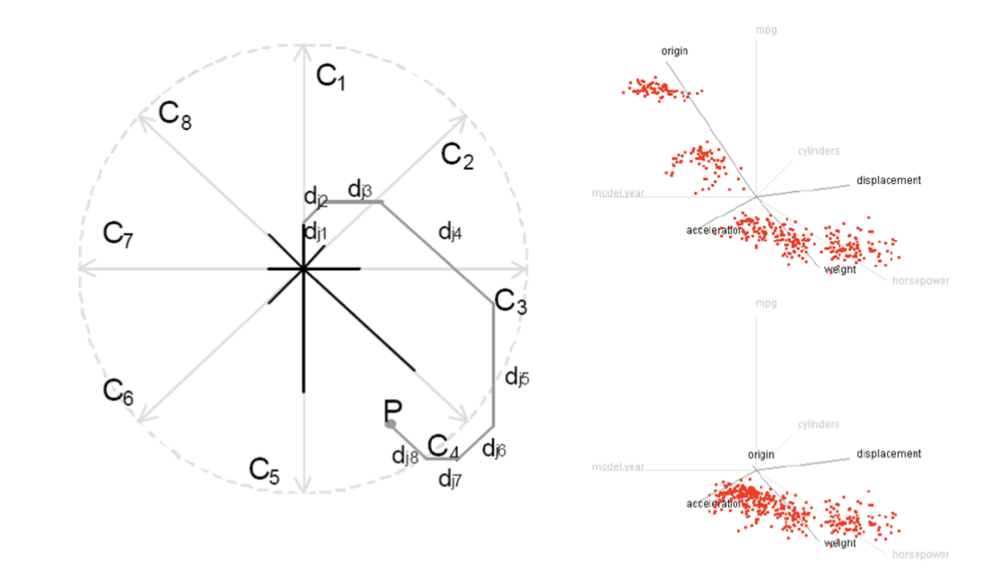
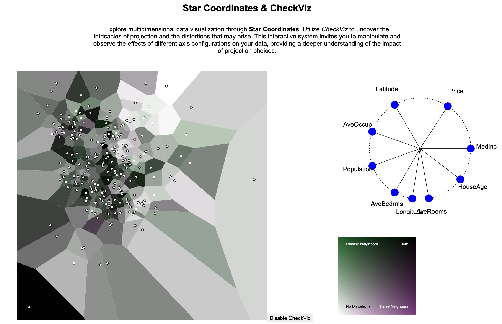

# Star Coordinates & CheckViz

## Introduction

### 1.1. Multidimensional Projections & Star Coordinates
Multidimensional Projections (MDP) are a principal methodology for visualizing high-dimensional data. The goal is to preserve the characteristics of high-dimensional space in a lower-dimensional embedding or projection, typically displayed as a scatterplot. In recent years, various high-performance MDP algorithms like t-SNE, UMAP, and Densmap have been developed, leading to numerous publications of MDP-based visualizations and analytical systems.

In this project, we aim to implement the Star Coordinates algorithm, a classic Linear projection method that accumulates the values of attributes along each axis vector to determine the 2D coordinates of high-dimensional data points. Star Coordinates allows users to interactively change the axis vectors, providing more insights compared to static projection algorithms. We will develop an Interactive Star Coordinates system where users can alter axis vectors through mouse interactions and observe the evolving scatterplot.

*Figure 1: Star Coordinates - The left image illustrates the accumulation of attribute values along the axis vectors to determine the data points' positions. The right image shows the changing projection as the axis vectors are altered.*

### 1.2. CheckViz: Visualizing MDP Distortions
While MDP effectively visualizes unseen high-dimensional data in 2D space, it inevitably introduces distortions due to the projection from a larger to a narrower space. To define and interpret these distortions, various attempts have been made, with the most common explanation based on Neighborhood relationships. According to this, MDP can result in two types of distortions: Missing Neighbors and False Neighbors.

Neglecting the presence of Missing and False Neighbors in data analysis can lead to erroneous conclusions. Therefore, systems have been developed to visualize these distortions, allowing for the assessment of trustworthiness within MDP. This project will implement the CheckViz visualization, which visualizes Missing and False Neighbors distortions following these steps:

1. Measure the extent of Missing and False Neighbors distortions for each data point.
2. Divide the 2D space into a Voronoi diagram.
3. Assign colors to Voronoi cells corresponding to the distortion level of each data point, with a color map that is provided as a functional implementation:
   - Green for Missing Neighbors distortion only.
   - Purple for False Neighbors distortion only.
   - Black for both distortions.
   - White for no distortion.

Voronoi diagrams partition space based on the positions of data points in 2D, ensuring that any location within a region is closest to its corresponding point. We will use the d3-delaunay library and polygon SVG elements to implement the Voronoi diagram.

Additionally, we will use the Trustworthiness and Continuity metrics to measure the distortions at each data point. These metrics provide implementation functions that return the degree of distortion when passed the high-dimensional and low-dimensional coordinates of the data points.

## System Overview

### Axis View
The Axis View in Star Coordinates displays the current status of the axes determining the positions of data points. Unlike the original Star Coordinates, which allow changes to both direction and magnitude of the axis vectors, our implementation will enable users to change only the direction through mouse drag interactions.

### Projection View
The Projection View visualizes the data points in the 2D space as determined by the axis vectors. When users alter the axis vectors in the Axis View, the positions of the data points in the Projection View update in real time. Users can also toggle the CheckViz visualization ON/OFF with a button press, based on the current projection of data points.

### Legend View
The color map used in the CheckViz visualization differs from typical color schemes as it needs to express both Missing and False Neighbors distortions. It requires a non-standard two-dimensional color map. Therefore, it is essential to provide a visualized legend for users to correctly interpret the CheckViz. The Legend View will visualize the two-dimensional color map as a square grid.

*Figure 2: Overview of the system*

## References
- Aupetit M., 2007, Neurocomputing, 70, 1304
- Kandogan E., 2000, in Proceedings of the IEEE information visualization symposium. p. 22
- Lespinats S., Aupetit M., 2011, in Computer Graphics Forum. pp 113–125
- McInnes L., Healy J., Melville J., 2018, arXiv preprint arXiv:1802.03426
- Narayan A., Berger B., Cho H., 2021, Nature Biotechnology, 39, 765
- Van der Maaten L., Hinton G., 2008, Journal of machine learning research, 9
- Venna J., Kaski S., 2006, Neural Networks, 19, 889
