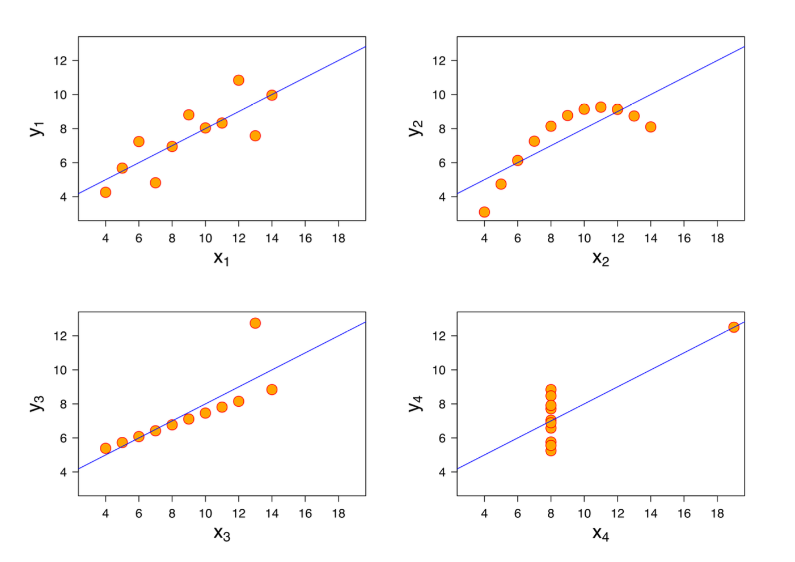
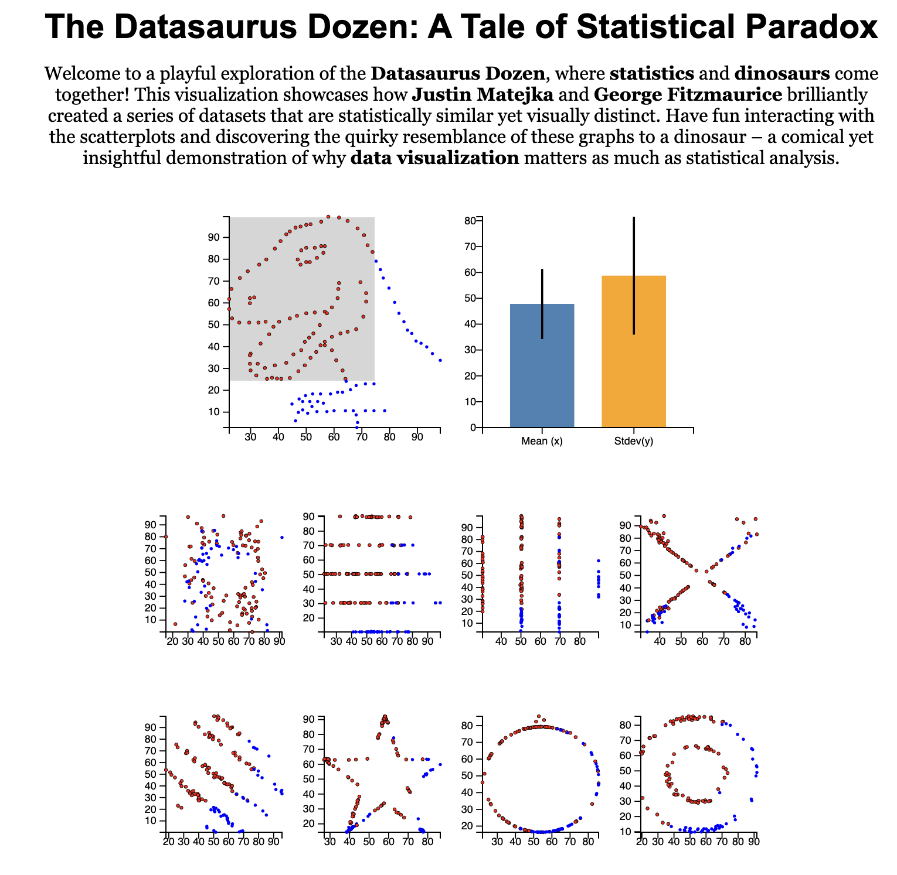

# Statistical Analysis and the Importance of Data Visualization

Traditional and widely recognized data analysis often involves **Statistical Analysis**. While statistical analysis provides the advantage of summarizing the entire data set into a few numbers for convenient interpretation, it also carries the risk of missing essential features during the summarization process. Despite this, many, including statisticians from the early to mid-20th century, believed that graphs were merely "pretty pictures" and that all critical information about the data could be represented using statistics (e.g., mean, standard deviation).

## Anscombe's Quartet

In 1973, statistician Francis Anscombe highlighted these limitations with an example called **Anscombe's Quartet** (Anscombe, 1973). He presented four datasets that, while having almost identical statistical properties (mean and standard deviation of x and y, linear regression line, and determination coefficient R² value), looked dramatically different when graphed. This example underlined the importance of data visualization to accurately grasp the data and catch features that statistical analysis might overlook.

  
*Figure 1: Anscombe's Quartet.*

## Datasaurus Dozen: The Modern Version

Although Anscombe's quartet is a famous example used to illustrate the significance of visualization, it was created around 50 years ago. The origins of how Anscombe initially created the data are unknown. To address this, in 2017, Justin Matejka and George Fitzmaurice presented a system to generate datasets, similar to Anscombe's quartet, with identical statistical properties but different appearances, titled **"Same Stats, Different Graphs"** (Matejka & Fitzmaurice, 2017).

This dataset, known as the **Datasaurus Dozen**, consists of 142 dinosaur-shaped data points (Datasaurus) and 12 other datasets derived by altering the data points from the Datasaurus. All these datasets share the same statistics (mean and standard deviation for x and y, Pearson correlation) but have varying appearances. For this project, we will use only the Datasaurus and eight other datasets from the Datasaurus Dozen.

  
*Figure 2: System Implementation.*

## References
- Anscombe F. J., 1973, The American Statistician, 27, 17
- Becker R. A., Cleveland W. S., 1987, Technometrics, 29, 127
- Bostock M., Ogievetsky V., Heer J., 2011, IEEE Transactions on Visualization and Computer Graphics, 17, 2301
