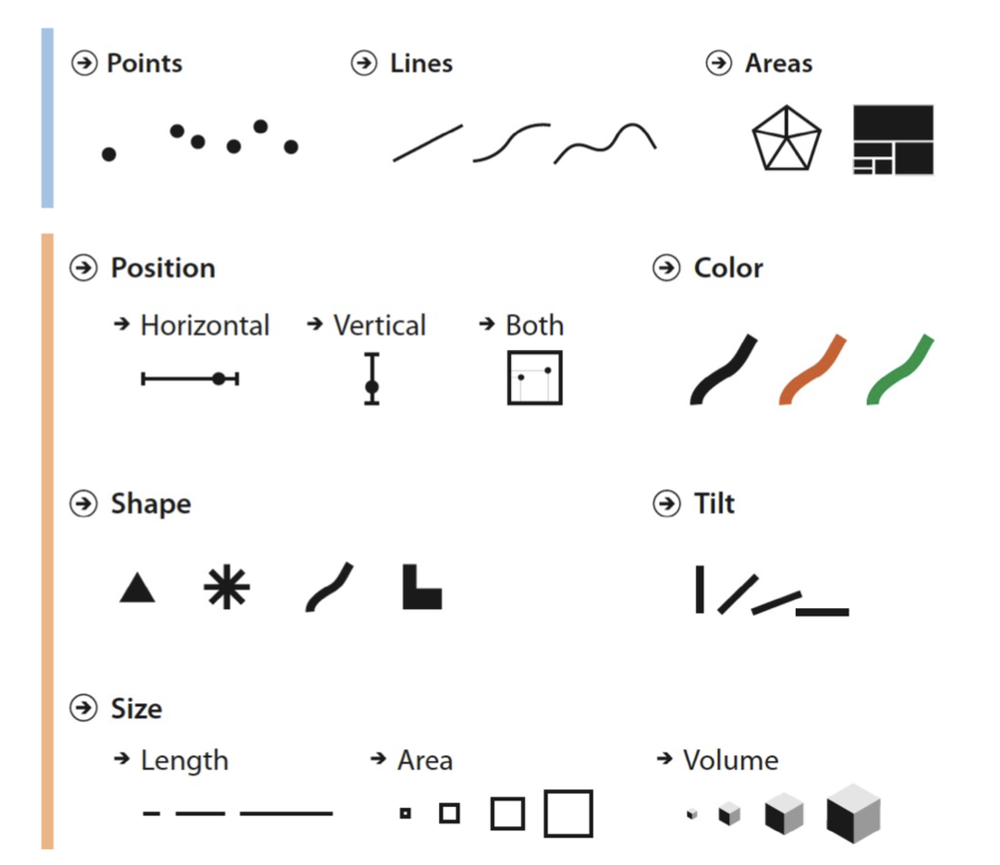
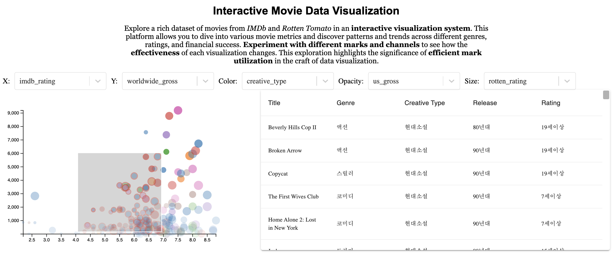

# Project Title: Importance of Marks & Channels in Representing Data

## Introduction
Visual idioms consist of two orthogonal components: marks and channels. Marks are the basic graphical elements, while channels are the manipulable attributes that define the appearance of marks. The design of visual idioms requires a thoughtful mapping of data attributes to channels, considering aspects like Expressiveness, Effectiveness, Separability, and Preattentive perception.

This project presents an interactive scatterplot-based visual analysis system developed with D3 and React, enabling users to dynamically map data attributes to various channels (x, y position, color, opacity, point size) for insightful data analysis.

## Modification of Channels
When unfamiliar with the data, deciding which data attribute to map to a visual channel can be challenging, often requiring trial and error. Visualization tools (e.g., Tableau, Spotfire, Vega-Lite) assist users through simple interactions like drag & drop to apply different channels to data attributes. Our system's objective is to facilitate this mapping process interactively, providing users the freedom to analyze data through various visual encodings.

## Useful Libraries for Web-based Visualizations
Effective development of web-based visual analysis systems necessitates the use of various libraries. While D3 is employed for crafting the central visualizations, additional functionalities are essential for interactive manipulation, utilization, and analysis. For instance, sliders for selecting time ranges in time-series data analysis can greatly enhance analytical freedom.

For this assignment, we recommend utilizing libraries like `react-select` for implementing selection features in the Control Panel and `material-table` for presenting detailed information of selected data through Table View.

## System Overview
The dataset used in this assignment includes various attributes of movies, such as genre, release time, ratings, and revenue. The Control Panel allows users to manipulate five channels (x position, y position, color, opacity, size) and decide which attributes to map through Drop-Down List Selection.

  
*Figure 2: Overview of the system*

## References
- Satyanarayan A., Moritz D., Wongsuphasawat K., Heer J., 2017, IEEE Transactions on Visualization and Computer Graphics, 23, 341

