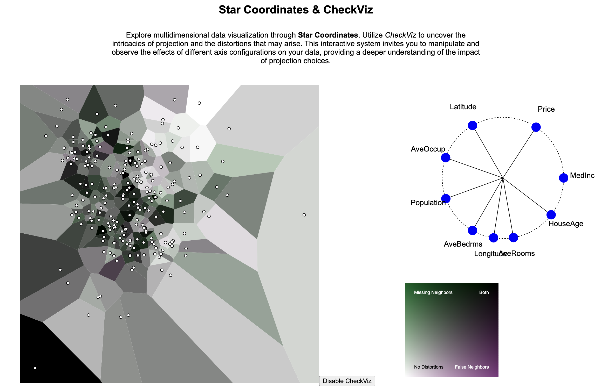

# Visualization Projects

This folder contains a series of data visualization projects, showcasing a variety of techniques and datasets. Each project is an exploration into the power of visual representation in understanding and communicating data-driven insights. Below are previews of the projects included in this folder.

## Project 1

*1. DataSaurus Dozen*

## Project 2

*2. Marks and Channels*

## Project 3

*3. Checkviz*

Each project in this collection demonstrates unique aspects of data visualization, from statistical analysis to interactive visual interfaces. Explore each project to discover the diverse ways in which data can be visualized and interpreted.
